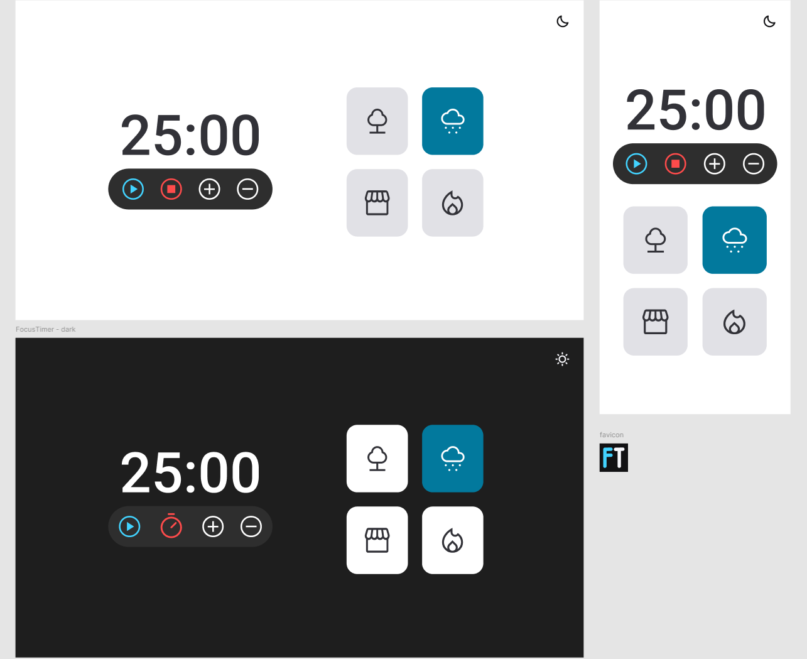

<h1 align="center">Focus Timer - Pomodoro</h1>

  

## 🚀 Tecnologias

Esse projeto foi desenvolvido com as seguintes tecnologias:

- HTML
- CSS
- JavaScript

## 💻 Projeto

Um cronometro no estilo Pomodore, com ele podemos inicar uma nova contagem, pausar, resetar, definir um novo tempo em mais 5 minutos ou menos 5 minutos e escolher entre quatro músicas de fundo nos botões ao lado. Esse projeto teve o intuito de aprofundar os estudos em JS, principalmente em ES6 modules.

---

Feito com ♥ by Cleber-Risu
